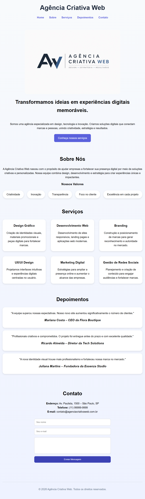

# 🚀 Agência Criativa Web

Projeto de landing page desenvolvido com **HTML5, SASS (SCSS), CSS3 e Node.js**, com foco em prática de layout moderno, responsividade, organização de código, boas práticas de desenvolvimento front-end.

---

## 📌 Sobre o projeto

A **Agência Criativa Web** é uma landing page fictícia criada para simular o site de uma agência digital.

Nesta versão do projeto foi realizada uma refatoração completa dos estilos utilizando **SASS (SCSS)**, com o objetivo de tornar o código mais organizado, reutilizável, modular e escalável.

### Principais melhorias implementadas:

* Aplicação da metodologia **BEM (Block, Element, Modifier)**
* Organização dos estilos em arquivos parciais (Partials)
* Utilização de variáveis SASS para cores, fontes e espaçamentos
* Criação de mixins reutilizáveis
* Uso de aninhamento de seletores
* Utilização de operadores SASS
* Separação entre layout, componentes e estilos globais
* Redução da duplicação de código
* Melhor manutenção e escalabilidade do código
* Preservação da responsividade em diferentes dispositivos

---

## 🎨 Layout do projeto

O site é composto por:

* 🏠 **Home** – apresentação principal com banner e chamada para ação
* 👩‍💼 **Sobre Nós** – descrição da agência e valores
* 💼 **Serviços** – cards com os principais serviços oferecidos
* 💬 **Depoimentos** – feedback de clientes fictícios
* 📞 **Contato** – formulário e informações de contato

---

## 💻 Tecnologias e conceitos utilizados

### Tecnologias 

* HTML5
* CSS3
* SASS (SCSS)
* Node.js

### Conceitos aplicados

* Metodologia BEM
* Flexbox
* CSS Grid
* Media Queries
* Variáveis SASS
* Mixins
* Partials
* Aninhamento de seletores
* Operadores SASS
* Componentização de estilos
* Responsividade

---

## 📱 Responsividade

O projeto é totalmente responsivo e se adapta a:

* 💻 Desktop
* 📱 Tablets
* 📱 Celulares

---

## 📂 Estrutura do projeto

```text
📁 agencia-criativa-web/
│ 
├── css/
│     ├── estilos.css 
│     └── estilos.css.map 
│ 
├── scss/ 
│     ├── _variaveis.scss 
│     ├── _mixins.scss 
│     ├── _base.scss 
│     ├── _layout.scss 
│     ├── _componentes.scss 
│     └── estilos.scss 
│
├── imagens/
│     ├── banner-grande.jpg
│     ├── banner-media.jpg
│     └── banner-pequena.jpg
│
├── index.html
├── package.json
└── README.md
```

---

## 🚀 Como executar o projeto

1. Baixe ou clone o repositório:

```bash
git clone https://github.com/IsabelleLandini/agencia-criativa-web.git 
```

2. Acesse a pasta do projeto

```bash
cd agencia-criativa-web
```

3. Instale as dependências

```bash
npm install
```

4. Compile o SASS

```bash
npx sass --watch scss/estilos.scss css/estilos.css
```

5. Execute o projeto

Abra o arquivo `index.html` no navegador ou utilize a extensão Live Server do VS Code.

---

## 🔧 Refatoração com SASS

Durante esta etapa do projeto foram aplicados os principais recursos do SASS:

* Estrutura modular utilizando Partials
* Importação moderna com `@use`
* Variáveis para cores, fontes e espaçamentos
* Mixins reutilizáveis para componentes
* Aninhamento de seletores
* Operadores para cálculos de espaçamento
* Organização dos estilos em arquivos específicos

---

## 📸 Preview do projeto

<p align="center">
  <strong>Landing Page da Agência Criativa Web</strong><br><br>
  
</p>

---

## 👩🏻‍💻 Autora

Desenvolvido por **Isabelle Landini**. 

✨ Projeto para estudo e portfólio pessoal em desenvolvimento web.
